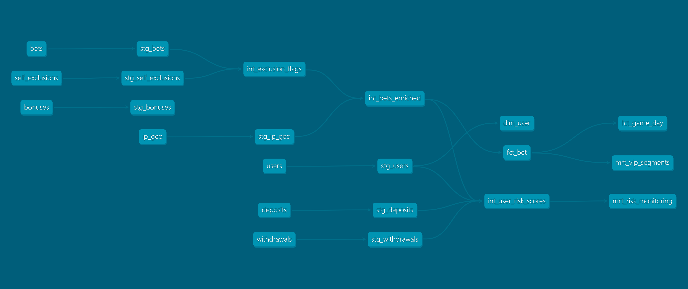

# Skin Gaming Analytics (dbt + DuckDB)

> **Domain:** Skin / iGaming (roulette, crash, coinflip)  
> **Focus:** Analytics engineering with business rules encoded in the **intermediate** layer and decision-ready marts for Product, Growth, and Compliance.

---

## Navigation / Quick Access
Quickly move to a section:

- [Overview](#overview)
- [Project Objective](#project-objective)
- [Project Architecture](#project-architecture)
- [Dataset](#dataset)
- [Technologies](#technologies)
- [Reproducing Project (long section)](#reproducing-project-long-section)
- [Repo Structure (abridged)](#repo-structure-abridged)

---

## Overview
This project shows how an **Analytics Engineer** turns noisy gaming events into **trustworthy, business-ready models** using dbt’s layered pattern (**staging → intermediate → marts**).

Key outcomes:
- Correct **RTP** (Return-to-Player) & **GGR** (stake − payout) on **valid** bets only.
- Split **bonus vs cash** stake to understand promo cost and abuse.
- Actionable **risk view** (IP/device risk, self-exclusion breaches, cashflow anomalies).
- Product-ready **daily facts** by game/day and **VIP segmentation** for growth.

---

## Project Objective
1. **Express domain rules explicitly** in the **intermediate** layer so downstream marts stay consistent and auditable.  
2. Deliver marts for **Product** (RTP, stakes, GGR), **Growth** (VIP tiers), and **Compliance/Risk** (exclusions, suspicious devices/IPs).  
3. Keep it **fully reproducible** (seeds + DuckDB). Anyone can clone → `dbt seed` → `dbt run`.

**Primary KPIs**
- **RTP** = `payouts / stakes` (valid bets only)  
- **GGR** = `stakes − payouts`  
- **Bonus share** = `bonus_stake / total_stake`  
- **User risk score** (IP risk + device sharing + exclusion breaches + cashflow ratio)

---

## Project Architecture

### Layers
- **staging/** — type casting, normalization  
- **intermediate/** — **business rules**
  - Flag **self-excluded** bets and set valid stake/payout to 0
  - Enrich with **IP geolocation + risk**
  - Split **bonus vs cash** stake
  - Aggregate **deposits/withdrawals** and compute **user risk score**
- **marts/** — analytics-ready
  - `core/fct_bet` — grain: bet  
  - `product/fct_game_day` — grain: game × day (**RTP, GGR, stakes, payouts**)  
  - `risk/mrt_risk_monitoring` — users to review  
  - `growth/mrt_vip_segments` — VIP/HIGH/MEDIUM/LOW by cumulative GGR

### Lineage Graph



---

## Dataset
Synthetic seeds in `/seeds` (loaded by `dbt seed`):

| Seed | Purpose | Key columns |
|---|---|---|
| **users.csv** | user attributes | `user_id, signup_date, country, kyc_level, device_id` |
| **bets.csv** | raw bet events | `bet_id, user_id, game, bet_ts, stake_usd, payout_usd, outcome, bonus_used, ip, device_id` |
| **deposits.csv** | payments in | `deposit_id, user_id, ts, amount_usd, method, status` |
| **withdrawals.csv** | payments out | `withdraw_id, user_id, ts, amount_usd, status` |
| **self_exclusions.csv** | compliance windows | `user_id, from_ts, to_ts` |
| **ip_geo.csv** | IP → country + risk | `ip, country, risk_score` |
| **bonuses.csv** | promo issuance | `bonus_id, user_id, issued_ts, type, value_usd, wagering_req_x` |

**Business-rule highlights**
- Bets **during self-exclusion** → treated as invalid (valid_stake/payout = 0; excluded from RTP/GGR).  
- Stake is split into **bonus_stake_usd** vs **cash_stake_usd**.  
- **GGR** computed only on **valid** bets: `stake_usd − payout_usd`.  
- **Risk score** blends avg IP risk, device sharing, exclusion breaches, and withdrawal/deposit ratio.

---

## Technologies
- **dbt-core** for modeling, lineage, and documentation  
- **dbt-duckdb + DuckDB** for a zero-setup local warehouse (file-based)  
- Optional alt-target: **Postgres** (flip `profile:` in `dbt_project.yml` + minor casts)  
- GitHub Actions (optional) for CI `dbt build`

---

## Reproducing Project (long section)

### 1) Prerequisites
- Python 3.10+  
- Install packages (typical):
  ```bash
  pip install dbt-core dbt-duckdb duckdb
  ```
  *(If Windows gives binary issues, pin: `dbt-core==1.9.2`, `dbt-duckdb==1.9.4`, `duckdb==1.0.0` or `0.10.3`.)*

### 2) Configure dbt profile (DuckDB)
Create `~/.dbt/profiles.yml` (Windows: `%USERPROFILE%\.dbt\profiles.yml`):
```yaml
duckdb:
  target: dev
  outputs:
    dev:
      type: duckdb
      path: ./warehouse.duckdb   # creates/uses a file in the project folder
      threads: 4
```

### 3) Build
From the project root (`skin_gaming_analytics_dbt`):
```bash
dbt debug
dbt seed --full-refresh
dbt run  --full-refresh
# or one-shot:
dbt build --full-refresh
```

### 4) Generate docs & lineage
```bash
dbt docs generate
dbt docs serve
```
Open the browser tab to explore lineage and column docs.

### 5) Troubleshooting
- **Function `date()` not found (DuckDB):** use `cast(ts as date)` instead of `date(ts)`.  
- **Profile not found:** pass `--profiles-dir ~/.dbt` (Windows: `--profiles-dir %USERPROFILE%\.dbt`).  
- **Python crash importing DuckDB on Windows:** use prebuilt wheels:  
  `pip install "dbt-duckdb==1.9.4" --only-binary=:all: "duckdb==1.0.0"` (or `0.10.3`).

### 6) Optional: Run on Postgres
- Change `profile: 'duckdb'` → `profile: 'postgres'` in `dbt_project.yml`.  
- Add a `postgres` profile in `profiles.yml` and set a project schema (e.g., `+schema: skingaming`).  
- Cast hints for Postgres: replace `null::double` with `null::double precision`; wrap `round(x,2)` as `round(x::numeric, 2)`.

---

## Repo Structure (abridged)
```
skin_gaming_analytics_dbt/
  dbt_project.yml
  macros/
  models/
    staging/
    intermediate/
    marts/
      core/
      product/
      growth/
      risk/
  seeds/
```